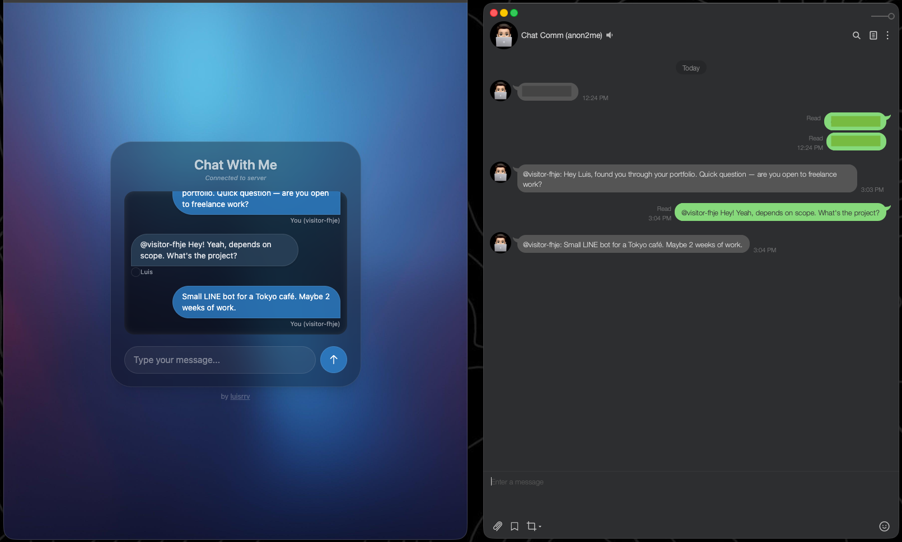
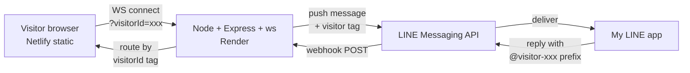

# chat2me

A public-facing web chat that bridges anonymous visitors to my private LINE account, with real-time replies routed back over WebSocket.

> A small, deployed system for exploring the constraints that show up when you stitch real-time browser sockets to a webhook-driven third-party messaging API.



**Live:** [anon2me.netlify.app](https://anon2me.netlify.app)  ·  **Stack:** Node.js · Express · `ws` · LINE Messaging API · Netlify (frontend) · Render (backend)

> **Note:** backend hosted on Render's free tier — first request after idle may take ~30s to wake.

---

## Why this exists

I wanted visitors on my site to be able to message me directly without exposing my LINE QR code or requiring them to sign in to anything. Email forms felt dated; LINE OA bots felt heavy. The interesting question was whether two-way realtime communication could work over a single WebSocket on the visitor side, with LINE webhooks fanning replies back through the right socket.

The constraints that shaped the design:

- **No login, no friction** for the visitor — anonymous, ephemeral.
- **My LINE account stays private** — visitors never get a handle to it.
- **No persistence** — this is a transient bridge, not a chat archive.
- **Minimal infra** — single small instance, free-tier hosting acceptable.
- **Honest scope** — link is shared privately; small concurrent load expected.

## Architecture



The server keeps a single in-memory `Map<visitorId, WebSocket>`. When a LINE reply comes in via webhook, the server parses the `@visitor-xxxx` prefix from the reply text and routes the message to the matching socket. No sessions, no DB, no queue.

## Key decisions

Each of these is an explicit tradeoff for the constraints above. Longer write-ups in [`docs/decisions/`](docs/decisions/).

| Decision | Why | Tradeoff accepted |
|---|---|---|
| **WebSocket over SSE/long-poll** | Bi-directional needed (visitor sends + receives). One connection is simpler than SSE + POST. | More state to manage; trickier through some proxies. [ADR](docs/decisions/0001-websocket-over-sse.md) |
| **In-memory state, no Redis/DB** | Messages are transient by design. Persistence would be infra without a user-facing requirement. | Restart drops active conversations; cannot scale horizontally. [ADR](docs/decisions/0002-in-memory-state.md) |
| **Visitor ID embedded in LINE message text** | Avoids a server-side correlation layer. LINE replies are stateless, so the routing key has to live somewhere — putting it in the message body makes it explicit and debuggable. | Slightly hacky UX (visible `@visitor-xxxx` tag); fragile if user edits the prefix. [ADR](docs/decisions/0003-visitor-id-in-message-text.md) |
| **`ws` over `socket.io`** | Native WebSocket protocol, no polling fallback machinery needed. ~10x smaller, no client SDK required. | No room reconnection helpers; reconnection logic is the client's responsibility. |
| **Render + Netlify split** | Frontend is static (Netlify CDN); backend needs a long-lived process for WS (Render). Keeps the static path fast and the dynamic path simple. | Two deploys to coordinate on schema changes. |

## Performance

Tested locally on a MacBook Pro (M-series, 16GB RAM) with the LINE forward call mocked
(`LOAD_TEST=1`) and a per-visitor send rate of one message every 6s — matching the
frontend's 5s cooldown.

### Test profile

Ramp from 0 → 1,000 concurrent WebSocket connections over 2.5 minutes, hold at 1,000 for
2 minutes, ramp down. Total ~5 minutes. 3,850 visitor sessions, ~35k messages exchanged.

### Results

| Metric | Value |
|---|---|
| Peak concurrent WS connections | **1,000** (sustained 2 min) |
| Connection errors | **0** out of 3,850 sessions |
| Ack round-trip latency — p50 / p95 / p99 | **1ms / 2ms / 3ms** |
| Ack round-trip latency — max | 65ms (single GC pause) |
| WS handshake — p95 | 3.3ms |
| Messages throughput at peak | 113 msg/s |
| Peak RSS at 1,000 connections | **72 MB** (~50KB / connection) |
| Heap behavior | Stable; no leak signature |

### What this means

The 1,000-connection ceiling is the **test ceiling, not the server ceiling** — server-side
metrics showed significant headroom (heap stable, RSS growing ~linearly with connections).
A higher cap would be needed to find the actual breaking point. For the use case described
in [Why this exists](#why-this-exists), 1,000 concurrent is already three orders of
magnitude above realistic load.

The deployed Render free tier has substantially less RAM and CPU than the test box, so
production capacity is bounded by the host, not the application. The relevant scaling
path is in [ADR-0002](docs/decisions/0002-in-memory-state.md).

## Limitations

Known and accepted, not hidden:

- **No webhook signature verification.** `/webhook` does not validate the `x-line-signature` HMAC. An attacker who learns the URL can inject arbitrary replies to any connected visitor. Mitigation in production would be HMAC verification + per-request body comparison; deferred because the URL is not advertised and the surface is small.
- **No persistence.** Server restart drops all active conversations; clients receive a `close` event and must reconnect. Acceptable for the use case.
- **Single instance only.** The `clients` Map is per-process, so the system cannot scale horizontally without external state. See [ADR-0002](docs/decisions/0002-in-memory-state.md) for the path to Redis pub/sub.
- **Frontend-only rate limiting.** The 5s cooldown and 300-char cap live in the browser. A determined client can bypass both. Server-side limits (per-IP, per-visitorId) would be the next addition.
- **No delivery guarantees.** If LINE returns 5xx or the visitor's WS is closed at the moment a reply arrives, the message is lost. A small in-memory retry queue with TTL would address the LINE side; offline-message storage would address the visitor side.
- **Reconnection is client-driven.** No server-side keepalive ping/pong; long-idle connections may be closed by Render's proxy.

## Local development

```bash
git clone https://github.com/luisrrv/chat2me
cd chat2me
npm install
cp .env.example .env   # fill in LINE channel secret + token
npm run dev
```

Open `http://localhost:3000`. Webhooks require a public URL — use [ngrok](https://ngrok.com) and register the forwarded URL in the LINE Developers console.

## License

MIT
